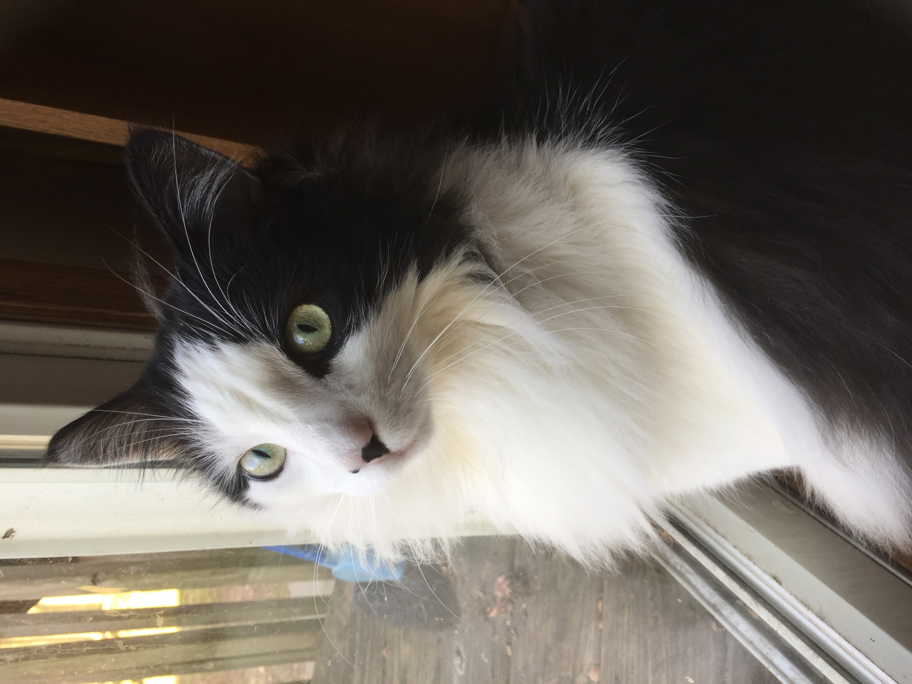

A candid shot of my beautiful and lazy cat, Garfield

# About Me

I am currently a first-year MS Biostatistics student at Columbia University's Mailman School of Public Health. I am passionate about working with data and would love to contribute to scientific insights in public health or medicine through data analysis. You can read about my education and experience background here:

[About me](about.html)

# Dashboard for P8105

I created a flexdashboard with plots using `plotly` in R and data from the NYC Restaurant Inspection dataset from the `p8105.datasets` package. To reduce computational burden, I narrowed the extensive dataset down to the Staten Island borough only:

[NYC Restaurant Inspection](rest_inspec.html)
